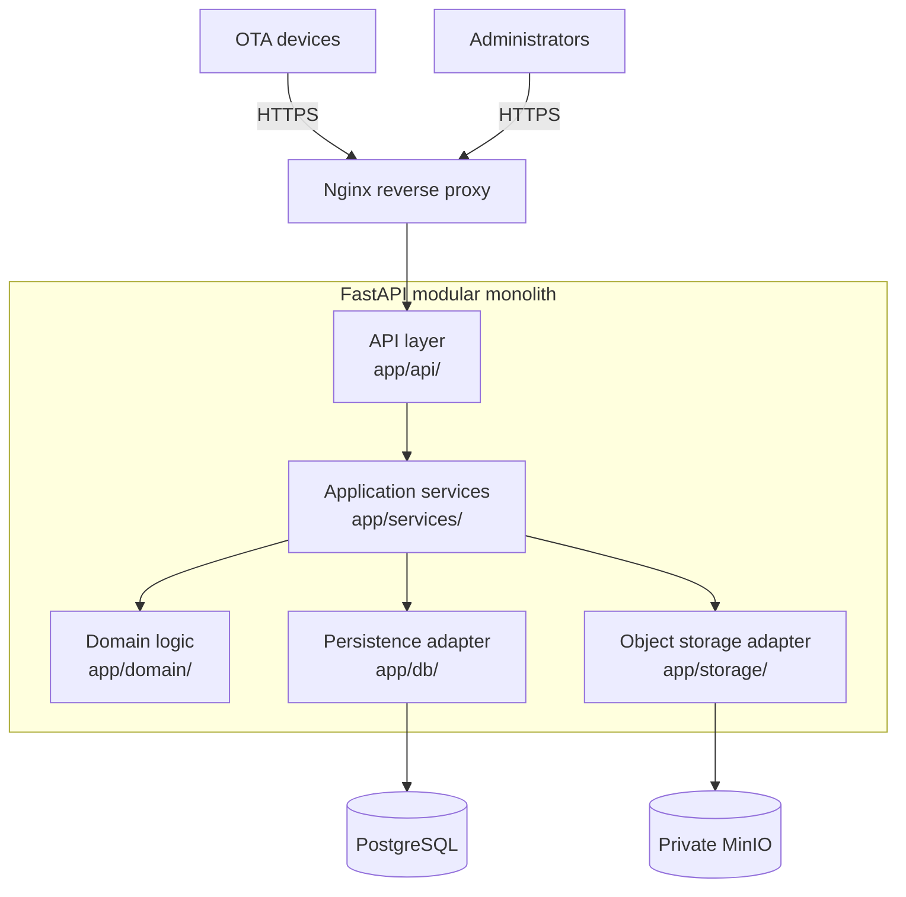

<div align="center">

# OTA Platform & Firmware Delivery Engine

### Secure firmware lifecycle and authenticated OTA delivery for connected devices

<p align="center">
  <a href="https://github.com/MRAbbasi1/OTA-Service/actions/workflows/ci.yml"></a>&nbsp;
  <a href="https://github.com/MRAbbasi1/OTA-Service/actions/workflows/deploy-production.yml"></a>&nbsp;
  <a href="https://python.org"></a>&nbsp;
  <a href="https://fastapi.tiangolo.com"></a><br>
  <a href="https://www.postgresql.org"></a>&nbsp;
  <a href="https://min.io"></a>&nbsp;
  <a href="https://www.docker.com"></a>&nbsp;
  <a href="LICENSE"></a>
</p>

</div>

<div align="center">

[Architecture](#system-architecture--system-design)
[Problem & Solution](#problem-statement--engineering-rationale)
[Security Model](#zero-trust-security--hardware-contract)
[Wire Protocol](#over-the-air-wire-protocol)
[Fleet Policies](#fleet-governance--update-policies)
[Documentation](#exhaustive-documentation-index)

</div>

## Executive Summary

**OTA-Service** is a backend and administration platform for managing firmware releases across connected device fleets, including ESP32-S3-based controllers.

Firmware delivery has requirements beyond file hosting: device identity must be checked at download time, firmware authenticity must be verifiable on the device, and release selection must respect product and policy boundaries. Embedded clients also impose specific HTTP and payload constraints.

The platform provides:

- **Device lifecycle and authentication** using registered identity and per-device credentials.
- **Firmware release management** with artifact validation, explicit publication, and signed manifests.
- **Authenticated delivery** through the application, with private MinIO storage and device-compatible response framing.
- **Deterministic update decisions** based on release eligibility and fleet policy.

---

## Problem Statement & Engineering Rationale

Embedded hardware update cycles face rigorous constraints that generic software delivery platforms and simple S3 file hosting fail to solve:

| Engineering challenge                               | Limitation of naive architectures                                                                                                                               | How OTA-Service addresses it                                                                                                            |
| --------------------------------------------------- | --------------------------------------------------------------------------------------------------------------------------------------------------------------- | --------------------------------------------------------------------------------------------------------------------------------------- |
| **Strict device identity verification**             | Presigned S3 URLs or public CDNs cannot authenticate individual hardware units at download time. Revoked or decommissioned devices may still download binaries. | **Dual-gate authentication** validates the device serial, raw eFuse MAC, and active token for manifest requests and firmware downloads. |
| **Microcontroller HTTP client limitations**         | Embedded TCP/TLS stacks may not support chunked transfer encoding or redirects.                                                                                 | **Exact-length streaming without redirects** proxies firmware from private MinIO with a `Content-Length` matching the signed manifest.  |
| **eFuse hardware vs. network MAC drift**            | Ethernet or Wi-Fi hardware may report a network MAC that differs from the silicon eFuse MAC.                                                                    | **Raw eFuse MAC identity** binds the device to the lower six bytes of `ESP.getEfuseMac()`.                                              |
| **Accidental downgrades and compatibility hazards** | Unchecked releases can push incompatible firmware or cause downgrades.                                                                                          | **Deterministic update decisions** enforce version rules and device-type boundaries.                                                    |
| **Storage traversal and secret leakage**            | Untrusted filenames or versions can introduce path traversal or expose internal storage.                                                                        | **Deterministic path derivation** builds URLs and object keys from validated release metadata.                                          |

---

## System Architecture & System Design

OTA-Service is intentionally architected as a **Modular Monolith** adhering to Domain-Driven Design (DDD) principles. It achieves physical deployment simplicity with a single containerized FastAPI runtime while enforcing logical boundaries across API, domain, service, and persistence layers.



1. **Edge / Reverse Proxy (`deploy/nginx/`)**:
   - Owns public ports `80` and `443`.
   - Terminates TLS for the device and administrative endpoints.
   - Routes both delivery hostnames to the application's local loopback port and disables buffering for firmware streaming.
2. **Presentation / Route Layer (`app/api/`)**:
   - Validates request payloads and serializes responses using Pydantic schemas.
   - Parses device headers and maps domain exceptions to protocol status codes.
   - Contains no update eligibility logic.
3. **Application Service Layer (`app/services/`)**:
   - Orchestrates use cases such as token generation and rotation, firmware uploads, audit logging, and eligibility evaluation.
4. **Pure Domain Layer (`app/domain/`)**:
   - Holds deterministic, I/O-free rules for policy precedence, version comparison, and manifest signing.
5. **Persistence and Storage Adapters (`app/db/`, `app/storage/`)**:
   - PostgreSQL is managed with SQLAlchemy 2.0 and Alembic.
   - Private MinIO storage is accessed through the `ObjectStorage` abstraction.

Automated unit, integration, API, OTA contract, and security tests cover core behavior. Continuous integration validates formatting, linting, types, migrations, tests, MinIO integration, dependencies, and the production container build.

---

## Zero-Trust Security & Hardware Contract

| Security area         | Design                                                             |
| --------------------- | ------------------------------------------------------------------ |
| Device identity       | Hardware serial, raw eFuse MAC, and 256-bit random token           |
| Device token storage  | SHA-256 digest; plaintext tokens are not stored                    |
| Admin authentication  | Argon2id password hashing and HS256 JWT                            |
| Admin web security    | HttpOnly, SameSite=Lax cookies and double-submit CSRF protection   |
| Object storage access | MinIO remains private and is not exposed to the Internet           |
| Firmware verification | Release signatures are verified against embedded ECDSA public keys |
| Audit trail           | Immutable event ledger that excludes credentials                   |

### Hardware Silicon Identity vs. Network MAC

Standard microcontrollers running Ethernet or Wi-Fi PHY stacks frequently report software-assigned or PHY MAC addresses that can differ from the burned factory eFuse.

- `OTA-Service` explicitly treats the **lower 6 bytes of `ESP.getEfuseMac()`** as an unforgeable hardware silicon anchor.
- Stored and compared as uppercase colon-separated hex (`AA:BB:CC:DD:EE:FF`).
- Prevents MAC mismatch errors and network hardware spoofing.

---

## Over-The-Air Wire Protocol

The device-facing surface is designed as an immutable hardware compatibility boundary for embedded clients.

### 1. Device Request Headers

Every manifest and firmware request is authenticated using the device's registered identity and credential. Exact header names and provisioning details are part of the [authoritative device contract](docs/OtaManager.md), not reproduced here.

### 2. Manifest Retrieval

The device requests its configured manifest route. The exact route and path parameters are intentionally omitted from this overview; see [the OTA contract](docs/04-ota-contract.md).

#### Response (`200 OK`):

```json
{
  "version": "<release-version>",
  "url": "<application-generated-delivery-url>",
  "md5": "<artifact-checksum>",
  "size": 0,
  "signature": "<release-pipeline-signature>"
}
```

> **Signature payload:** the canonical values are joined as `<version>|<url>|<md5>|<size>`. The placeholders above are schematic and are not valid release data.

### 3. Firmware Binary Stream

The firmware URL is generated by the application from validated release metadata and delivered by the application after device authentication and entitlement checks. Concrete hostnames and path parameters are documented in the deployment contract, not repeated here.

- Authenticates the device before emitting a single byte.
- Streams the binary directly from private object storage with an exact `Content-Length` header matching `size`.
- **No HTTP 3xx redirects are issued.** (A redirect breaks the device's internal client and drains its retry quota).

### 4. Protocol Response Semantics

| Scenario                                             |       HTTP Status       | Device Client Action                                                  |
| :--------------------------------------------------- | :---------------------: | :-------------------------------------------------------------------- |
| **New Compatible Version Available**                 |        `200 OK`         | Downloads manifest, verifies signature, initiates binary stream.      |
| **Fleet Up To Date / No Release**                    |     `404 Not Found`     | Graceful standby; device enters idle sleep until the next poll cycle. |
| **Invalid device credential**                        |   `401 Unauthorized`    | Device authentication failure handling.                               |
| **Unknown, identity-mismatched, or disabled device** |     `403 Forbidden`     | Immediate device-side lockout behavior.                               |
| **No eligible release**                              |     `404 Not Found`     | No offer; the device checks again on its next scheduled poll.         |
| **Rate limited**                                     | `429 Too Many Requests` | No immediate retry; resume at the next normal poll.                   |
| **Transient Cloud Error**                            |   `5xx Server Error`    | Exponential backoff retry with deterministic device jitter.           |

---

## Fleet Governance & Update Policies

The update engine evaluates firmware eligibility through a deterministic priority cascade. Route handlers never make update decisions.

```
       [ Device Requests Manifest ]
                   │
                   ▼
     ┌───────────────────────────┐
     │  Device Authenticated?    │────── No ─────► [ 401 Unauthorized ]
     └───────────────────────────┘
                   │ Yes
                   ▼
     ┌───────────────────────────┐
     │  Device Active & Enabled? │────── No ─────► [ 403 Forbidden / 404 No Offer ]
     └───────────────────────────┘
                   │ Yes
                   ▼
     ┌───────────────────────────┐
     │   Device-Specific Policy  │─── Matches ───► [ Apply Device Policy (Pin / Disable) ]
     └───────────────────────────┘
                   │ None
                   ▼
     ┌───────────────────────────┐
     │   Device-Type Policy      │─── Matches ───► [ Apply Model Policy (Range / Pin) ]
     └───────────────────────────┘
                   │ None
                   ▼
     ┌───────────────────────────┐
     │   Global Update Policy    │─── Matches ───► [ Apply Default Fleet Rule ]
     └───────────────────────────┘
                   │ None
                   ▼
     [ Serve Latest Published Compatible Release ]
```

### Policy Types & Rules

- **`PIN`**: Locks devices to an exact target version (e.g. `2.5.8`) for troubleshooting or canary validation.
- **`RANGE`**: Constrains eligible updates within `[min_version, max_version]` SemVer boundaries.
- **`DISABLE`**: Temporarily halts updates for specific devices or entire device types during operational freezes.
- **Conflict Prevention**: Overlapping time windows with identical precedence are rejected at creation time rather than causing ambiguous runtime decisions.

---

## Technology Stack & Infrastructure

```
Backend Core      Python 3.13 (AsyncIO, Strict Typing)
Web Framework     FastAPI 0.115+ / Starlette / Uvicorn
Database          PostgreSQL 18 + SQLAlchemy 2.0 (ORM/Core) + Alembic
Object Store      MinIO (Amazon S3 Compatible Blob Storage)
Security          Argon2id (argon2-cffi) + PyJWT (HS256) + ECDSA Verification
Deployment        Docker (Multi-stage distroless) + Nginx Reverse Proxy
Package Manager   Astral uv (Deterministic dependency locks)
Test Engine       Pytest + Pytest-Asyncio + Pytest-Cov + HTTPX
CI / CD           GitHub Actions Workflows (Automated Linting, Typing, Testing)
```

---

## Repository Layout

```text
OTA-Service/
├── app/
│   ├── api/v1/             # Presentation layer: OTA, Admin, Dashboard, Auth routes
│   │   ├── admin_auth.py   # Admin login, sessions, CSRF, account security
│   │   ├── dashboard.py    # Fleet metrics, firmware distribution, audit trail
│   │   ├── devices.py      # Device lifecycle, token provisioning & rotation
│   │   ├── firmware.py     # Binary artifact upload & release publishing
│   │   ├── health.py       # Kubernetes/Nginx health & readiness probes
│   │   ├── ota.py          # Device compatibility endpoints (manifest & download)
│   │   ├── policies.py     # Update policy management (pin, range, disable)
│   │   └── schemas.py      # Pydantic v2 domain & API boundary contracts
│   ├── cli/                # Initial administrator bootstrap utility
│   ├── core/               # Central configuration, logging, and security primitives
│   ├── db/                 # Database engine, session lifecycle, and SQLAlchemy models
│   ├── domain/             # Zero-dependency, pure domain logic (policy, version, manifest)
│   ├── services/           # Transactional application services & business operations
│   └── storage/            # Object storage interfaces & MinIO adapters
├── alembic/                # Database migration versions
├── deploy/                 # Production Nginx virtual hosts & system configuration
├── docs/                   # Full architectural documentation suite (00 to 16)
├── tests/                  # Exhaustive unit, integration, and security test suite
├── Dockerfile              # Production multi-stage OCI container definition
├── pyproject.toml          # Project configuration, dependencies, and tooling rules
└── LICENSE                 # Open-Source MIT License
```

---

## Quality & Testing

Automated unit, integration, API, OTA contract, and security tests cover the platform's core behavior. Continuous integration validates formatting, linting, types, database migrations, the test suite, MinIO integration, dependencies, and the production container build.

## Documentation

The platform's requirements, architecture, device contract, security model, operations, and implementation decisions are documented in detail.

| Document                                                                               | Focus                                                              |
| -------------------------------------------------------------------------------------- | ------------------------------------------------------------------ |
| [Project overview](docs/00-project-overview.md)                                        | Scope and system context                                           |
| [Requirements](docs/01-requirements.md)                                                | Functional and operational requirements                            |
| [Domain model](docs/02-domain-model.md)                                                | Entities, lifecycle, and invariants                                |
| [Architecture](docs/03-architecture.md)                                                | Application boundaries and dependencies                            |
| [OTA contract](docs/04-ota-contract.md)                                                | Device-facing protocol requirements                                |
| [Device management](docs/05-device-management.md)                                      | Enrollment, identity, and lifecycle                                |
| [Firmware management](docs/06-firmware-management.md)                                  | Artifact validation and release lifecycle                          |
| [Update policy](docs/07-update-policy.md)                                              | Policy scope, precedence, and eligibility                          |
| **[`docs/08-security.md`](docs/08-security.md)**                                       | Cryptography, threat modeling, and credential protection           |
| **[`docs/09-api-specification.md`](docs/09-api-specification.md)**                     | RESTful Admin and Dashboard API reference                          |
| **[`docs/10-storage.md`](docs/10-storage.md)**                                         | MinIO bucket layout, path derivation, and streaming mechanics      |
| **[`docs/11-testing-strategy.md`](docs/11-testing-strategy.md)**                       | Testing pyramid, fixture design, and security fuzzing              |
| **[`docs/12-observability.md`](docs/12-observability.md)**                             | Telemetry, structured logs, and monitoring metrics                 |
| **[`docs/13-deployment.md`](docs/13-deployment.md)**                                   | Nginx edge setup, systemd integration, and TLS certificates        |
| **[`docs/14-ci-cd.md`](docs/14-ci-cd.md)**                                             | GitHub Actions automation, release gating, and image publishing    |
| **[`docs/15-implementation-decisions.md`](docs/15-implementation-decisions.md)**       | Architectural decisions, rate limits, and wire invariants          |
| **[`docs/16-update-path-and-publication.md`](docs/16-update-path-and-publication.md)** | Canonical URL derivation, artifact publication, and length budgets |
| **[`docs/OtaManager.md`](docs/OtaManager.md)**                                         | Device-side firmware reference (ESP32-S3 Arduino/C++ client)       |

---

## License & Open Source

This project is open-source and released under the **MIT License**.
You are free to use, inspect, modify, and distribute this platform in commercial and private environments.
See the full terms in the [`LICENSE`](LICENSE) file.

---

<div align="center">
  <sub>Open-source firmware delivery and fleet management for connected devices.</sub>
</div>
